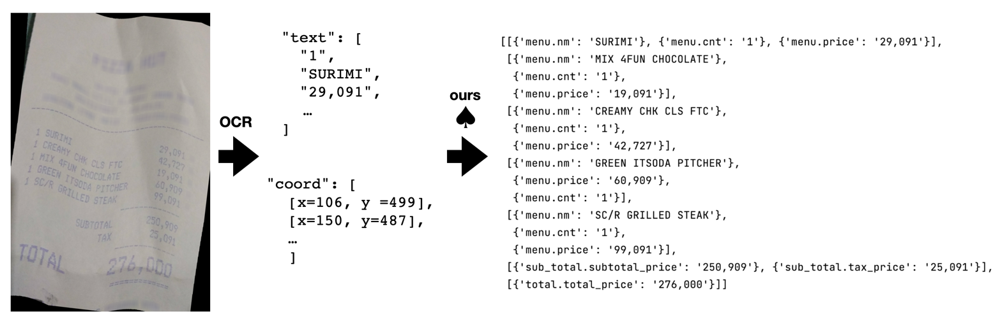

# SPADE

## Introduction

- This repository contains the source code of our recent publication
  [Spatial Dependency Parsing for Semi-Structured Document Information Extraction](https://arxiv.org/abs/2005.00642).
  The paper is accepted at Findings of ACL 2021.

- SPADE♠️ (SPAtial DEpendency parsing) accepts 2D text (text segments and their xy-coordinates).
- SPADE♠ generates the graph that represents semi-structured documents (such as receipts, name cards, invoices).

## Task



## Setup

- The code is tested on `NVIDIA-P40`,
  `NAME="Ubuntu", VERSION="16.04.6 LTS (Xenial Xerus)"`

1. `conda create --name spade  python==3.7.10`
2. `conda activate spade`
3. `git clone [this-repo]`
4. `pip install -r requirements`
5. Download  `data.tar.gz` from [here](https://drive.google.com/file/d/1863IJuyxFh82wTfxrUQ-Jk5NTTbHYsfK/view?usp=sharing). The file also include the small model trained
   on [CORD](https://github.com/clovaai/cord) dataset.

  ```
  mv data.tar.gz [project-dir]
  tar xvfz data.tar.gz
  ```

5. Download pretrained multi-lingual bert

```
cd scripts
python download_pretrained_models.py
```

6. Test the code with the sample data (input: `./data/samples/cord_predict.json`)

   `bash scripts/predict_cord.sh`


7. (Optional) Download funsd dataset

   `bash scripts/preprocess_funsd.sh`

## Data

### Input (type1)

- Example from CORD-dev (`data/sample/cord_dev.jsonl`)
  ```
  {
    "data_id": 0, 
    "fields": ["menu.cnt", "menu.discountprice", "menu.itemsubtotal", "menu.nm", "menu.price", "menu.sub_cnt", "menu.sub_nm", "menu.sub_price", "menu.unitprice", "menu.sub_num", "menu.discountprice", "menu.num", "menu.sub_discountprice", "menu.sub_etc", "menu.etc", "menu.vatyn", "menu.itemsubtotal", "menu.sub_unitprice", "sub_total.discount_price", "sub_total.service_price", "sub_total.subtotal_price", "sub_total.tax_price", "sub_total.tax_and_service", "sub_total.etc", "sub_total.othersvc_price", "total.total_price", "total.menuqty_cnt", "total.total_etc", "total.emoneyprice", "total.menutype_cnt", "total.cashprice", "total.changeprice", "total.creditcardprice", "void_menu.nm", "void_menu.cnt", "void_menu.price", "void_menu.unitprice", "void_total.total_price", "void_total.subtotal_price", "void_total.tax_price", "void_total.etc"],
    "field_rs": ["menu.nm", "sub_total.subtotal_price", "total.total_price", "void_menu.nm", "void_total.total_price"], 
    "text": ["1", "REAL", "GANACHE", "16,500", ...]  
    "label": [[[1, 0, 0, 0, 1, 0, 0, 0, 1, 0, 0, 0, 0, 0, 0, 0, 0, 0], [0, 0, 0, 0, 0, 0, 0, 0, 0, 0, 0, 0, 0, 0, 0, 0, 0, 0], [0, 0, 0, 0, 0, 0, 0, 0, 0, 0, 0, 0, 0, 0, 0, 0, 0, 0], [0, 1, 0, 0, 0, 1, 0, 0, 0, 1, 0, 0, 0, 0, 0, 0, 0, 0], [0, 0, 0, 1, 0, 0, 0, 1, 0, 0, 0, 1, 0, 0, 0, 0, 0, 0], [0, 0, 0, 0, 0, 0, 0, 0, 0, 0, 0, 0, 0, 0, 0, 0, 0, 0], [0, 0, 0, 0, 0, 0, 0, 0, 0, 0, 0, 0, 0, 0, 0, 0, 0, 0], [0, 0, 0, 0, 0, 0, 0, 0, 0, 0, 0, 0, 0, 0, 0, 0, 0, 0], [0, 0, 0, 0, 0, 0, 0, 0, 0, 0, 0, 0, 0, 0, 0, 0, 0, 0], [0, 0, 0, 0, 0, 0, 0, 0, 0, 0, 0, 0, 0, 0, 0, 0, 0, 0], [0, 0, 0, 0, 0, 0, 0, 0, 0, 0, 0, 0, 0, 0, 0, 0, 0, 0], [0, 0, 0, 0, 0, 0, 0, 0, 0, 0, 0, 0, 0, 0, 0, 0, 0, 0], [0, 0, 0, 0, 0, 0, 0, 0, 0, 0, 0, 0, 0, 0, 0, 0, 0, 0], [0, 0, 0, 0, 0, 0, 0, 0, 0, 0, 0, 0, 0, 0, 0, 0, 0, 0], [0, 0, 0, 0, 0, 0, 0, 0, 0, 0, 0, 0, 0, 0, 0, 0, 0, 0], [0, 0, 0, 0, 0, 0, 0, 0, 0, 0, 0, 0, 0, 0, 0, 0, 0, 0], [0, 0, 0, 0, 0, 0, 0, 0, 0, 0, 0, 0, 0, 0, 0, 0, 0, 0], [0, 0, 0, 0, 0, 0, 0, 0, 0, 0, 0, 0, 0, 0, 0, 0, 0, 0], [0, 0, 0, 0, 0, 0, 0, 0, 0, 0, 0, 0, 0, 0, 0, 0, 0, 0], [0, 0, 0, 0, 0, 0, 0, 0, 0, 0, 0, 0, 0, 0, 0, 0, 0, 0], [0, 0, 0, 0, 0, 0, 0, 0, 0, 0, 0, 0, 0, 0, 0, 0, 0, 0], [0, 0, 0, 0, 0, 0, 0, 0, 0, 0, 0, 0, 0, 0, 0, 0, 0, 0], [0, 0, 0, 0, 0, 0, 0, 0, 0, 0, 0, 0, 0, 0, 0, 0, 0, 0], [0, 0, 0, 0, 0, 0, 0, 0, 0, 0, 0, 0, 0, 0, 0, 0, 0, 0], [0, 0, 0, 0, 0, 0, 0, 0, 0, 0, 0, 0, 0, 0, 0, 0, 0, 0], [0, 0, 0, 0, 0, 0, 0, 0, 0, 0, 0, 0, 0, 1, 0, 0, 0, 0], [0, 0, 0, 0, 0, 0, 0, 0, 0, 0, 0, 0, 0, 0, 0, 0, 0, 0], [0, 0, 0, 0, 0, 0, 0, 0, 0, 0, 0, 0, 0, 0, 0, 0, 0, 0], [0, 0, 0, 0, 0, 0, 0, 0, 0, 0, 0, 0, 0, 0, 0, 0, 0, 0], [0, 0, 0, 0, 0, 0, 0, 0, 0, 0, 0, 0, 0, 0, 0, 0, 0, 0], [0, 0, 0, 0, 0, 0, 0, 0, 0, 0, 0, 0, 0, 0, 0, 1, 0, 0], [0, 0, 0, 0, 0, 0, 0, 0, 0, 0, 0, 0, 0, 0, 0, 0, 0, 1], [0, 0, 0, 0, 0, 0, 0, 0, 0, 0, 0, 0, 0, 0, 0, 0, 0, 0], [0, 0, 0, 0, 0, 0, 0, 0, 0, 0, 0, 0, 0, 0, 0, 0, 0, 0], [0, 0, 0, 0, 0, 0, 0, 0, 0, 0, 0, 0, 0, 0, 0, 0, 0, 0], [0, 0, 0, 0, 0, 0, 0, 0, 0, 0, 0, 0, 0, 0, 0, 0, 0, 0], [0, 0, 0, 0, 0, 0, 0, 0, 0, 0, 0, 0, 0, 0, 0, 0, 0, 0], [0, 0, 0, 0, 0, 0, 0, 0, 0, 0, 0, 0, 0, 0, 0, 0, 0, 0], [0, 0, 0, 0, 0, 0, 0, 0, 0, 0, 0, 0, 0, 0, 0, 0, 0, 0], [0, 0, 0, 0, 0, 0, 0, 0, 0, 0, 0, 0, 0, 0, 0, 0, 0, 0], [0, 0, 0, 0, 0, 0, 0, 0, 0, 0, 0, 0, 0, 0, 0, 0, 0, 0], [0, 0, 0, 0, 0, 0, 0, 0, 0, 0, 0, 0, 0, 0, 0, 0, 0, 0], [0, 0, 1, 0, 0, 0, 0, 0, 0, 0, 0, 0, 0, 0, 0, 0, 0, 0], [0, 0, 0, 0, 0, 0, 0, 0, 0, 0, 0, 0, 0, 0, 0, 0, 0, 0], [0, 0, 0, 0, 0, 0, 0, 0, 0, 0, 0, 0, 0, 0, 0, 0, 0, 0], [0, 0, 0, 0, 0, 0, 0, 0, 0, 0, 0, 0, 0, 0, 0, 0, 0, 0], [0, 0, 0, 0, 0, 0, 1, 0, 0, 0, 0, 0, 0, 0, 0, 0, 0, 0], [0, 0, 0, 0, 0, 0, 0, 0, 0, 0, 0, 0, 0, 0, 0, 0, 0, 0], [0, 0, 0, 0, 0, 0, 0, 0, 0, 0, 0, 0, 0, 0, 0, 0, 0, 0], [0, 0, 0, 0, 0, 0, 0, 0, 0, 0, 0, 0, 0, 0, 0, 0, 0, 0], [0, 0, 0, 0, 0, 0, 0, 0, 0, 0, 1, 0, 0, 0, 0, 0, 0, 0], [0, 0, 0, 0, 0, 0, 0, 0, 0, 0, 0, 0, 0, 0, 0, 0, 0, 0], [0, 0, 0, 0, 0, 0, 0, 0, 0, 0, 0, 0, 0, 0, 0, 0, 0, 0], [0, 0, 0, 0, 0, 0, 0, 0, 0, 0, 0, 0, 0, 0, 0, 0, 0, 0], [0, 0, 0, 0, 0, 0, 0, 0, 0, 0, 0, 0, 0, 0, 0, 0, 0, 0], [0, 0, 0, 0, 0, 0, 0, 0, 0, 0, 0, 0, 0, 0, 0, 0, 0, 0], [0, 0, 0, 0, 0, 0, 0, 0, 0, 0, 0, 0, 0, 0, 0, 0, 0, 0], [0, 0, 0, 0, 0, 0, 0, 0, 0, 0, 0, 0, 0, 0, 0, 0, 0, 0], [0, 0, 0, 0, 0, 0, 0, 0, 0, 0, 0, 0, 0, 0, 0, 0, 0, 0]], [[0, 0, 0, 0, 0, 0, 0, 0, 0, 0, 0, 0, 0, 0, 0, 0, 0, 0], [0, 0, 0, 0, 0, 0, 0, 0, 0, 0, 0, 0, 0, 0, 0, 0, 0, 0], [0, 0, 0, 0, 0, 0, 0, 0, 0, 0, 0, 0, 0, 0, 0, 0, 0, 0], [0, 0, 0, 0, 0, 0, 0, 0, 0, 0, 0, 0, 0, 0, 0, 0, 0, 0], [0, 0, 0, 0, 0, 0, 0, 0, 0, 0, 0, 0, 0, 0, 0, 0, 0, 0], [0, 0, 0, 0, 0, 0, 0, 0, 0, 0, 0, 0, 0, 0, 0, 0, 0, 0], [0, 0, 0, 0, 0, 0, 0, 0, 0, 0, 0, 0, 0, 0, 0, 0, 0, 0], [0, 0, 0, 0, 0, 0, 0, 0, 0, 0, 0, 0, 0, 0, 0, 0, 0, 0], [0, 0, 0, 0, 0, 0, 0, 0, 0, 0, 0, 0, 0, 0, 0, 0, 0, 0], [0, 0, 0, 0, 0, 0, 0, 0, 0, 0, 0, 0, 0, 0, 0, 0, 0, 0], [0, 0, 0, 0, 0, 0, 0, 0, 0, 0, 0, 0, 0, 0, 0, 0, 0, 0], [0, 0, 0, 0, 0, 0, 0, 0, 0, 0, 0, 0, 0, 0, 0, 0, 0, 0], [0, 0, 0, 0, 0, 0, 0, 0, 0, 0, 0, 0, 0, 0, 0, 0, 0, 0], [0, 0, 0, 0, 0, 0, 0, 0, 0, 0, 0, 0, 0, 0, 0, 0, 0, 0], [0, 0, 0, 0, 0, 0, 0, 0, 0, 0, 0, 0, 0, 0, 0, 0, 0, 0], [0, 0, 0, 0, 0, 0, 0, 0, 0, 0, 0, 0, 0, 0, 0, 0, 0, 0], [0, 0, 0, 0, 0, 0, 0, 0, 0, 0, 0, 0, 0, 0, 0, 0, 0, 0], [0, 0, 0, 0, 0, 0, 0, 0, 0, 0, 0, 0, 0, 0, 0, 0, 0, 0], [0, 0, 0, 0, 0, 0, 0, 0, 0, 0, 0, 0, 0, 0, 0, 0, 0, 0], [0, 0, 0, 0, 0, 0, 0, 0, 0, 0, 0, 0, 0, 0, 0, 0, 0, 0], [0, 0, 0, 0, 0, 0, 0, 0, 0, 0, 0, 0, 0, 0, 0, 0, 0, 0], [0, 0, 0, 0, 0, 0, 0, 0, 0, 0, 0, 0, 0, 0, 0, 0, 0, 0], [0, 0, 0, 0, 0, 0, 0, 0, 0, 0, 0, 0, 0, 0, 0, 0, 0, 0], [0, 0, 0, 0, 0, 0, 0, 0, 0, 0, 0, 0, 0, 0, 0, 0, 0, 0], [0, 0, 0, 0, 0, 0, 0, 0, 0, 0, 0, 0, 0, 0, 0, 0, 0, 0], [0, 0, 0, 0, 0, 0, 0, 0, 0, 0, 0, 0, 0, 0, 0, 0, 0, 0], [0, 0, 0, 0, 0, 0, 0, 0, 0, 0, 0, 0, 0, 0, 0, 0, 0, 0], [0, 0, 0, 0, 0, 0, 0, 0, 0, 0, 0, 0, 0, 0, 0, 0, 0, 0], [0, 0, 0, 0, 0, 0, 0, 0, 0, 0, 0, 0, 0, 0, 0, 0, 0, 0], [0, 0, 0, 0, 0, 0, 0, 0, 0, 0, 0, 0, 0, 0, 0, 0, 0, 0], [0, 0, 0, 0, 0, 0, 0, 0, 0, 0, 0, 0, 0, 0, 0, 0, 0, 0], [0, 0, 0, 0, 0, 0, 0, 0, 0, 0, 0, 0, 0, 0, 0, 0, 0, 0], [0, 0, 0, 0, 0, 0, 0, 0, 0, 0, 0, 0, 0, 0, 0, 0, 0, 0], [0, 0, 0, 0, 0, 0, 0, 0, 0, 0, 0, 0, 0, 0, 0, 0, 0, 0], [0, 0, 0, 0, 0, 0, 0, 0, 0, 0, 0, 0, 0, 0, 0, 0, 0, 0], [0, 0, 0, 0, 0, 0, 0, 0, 0, 0, 0, 0, 0, 0, 0, 0, 0, 0], [0, 0, 0, 0, 0, 0, 0, 0, 0, 0, 0, 0, 0, 0, 0, 0, 0, 0], [0, 0, 0, 0, 0, 0, 0, 0, 0, 0, 0, 0, 0, 0, 0, 0, 0, 0], [0, 0, 0, 0, 0, 0, 0, 0, 0, 0, 0, 0, 0, 0, 0, 0, 0, 0], [0, 0, 0, 0, 0, 0, 0, 0, 0, 0, 0, 0, 0, 0, 0, 0, 0, 0], [0, 0, 0, 0, 0, 0, 0, 0, 0, 0, 0, 0, 0, 0, 0, 0, 0, 0], [0, 0, 0, 0, 0, 0, 0, 0, 0, 0, 0, 0, 0, 0, 0, 0, 0, 0], [1, 0, 0, 1, 0, 0, 0, 0, 0, 0, 0, 0, 0, 0, 0, 0, 0, 0], [0, 0, 0, 0, 0, 0, 0, 0, 0, 0, 0, 0, 0, 0, 0, 0, 0, 0], [0, 0, 0, 0, 0, 0, 0, 0, 0, 0, 0, 0, 0, 0, 0, 0, 0, 0], [0, 0, 0, 0, 0, 0, 0, 0, 0, 0, 0, 0, 0, 0, 0, 0, 0, 0], [0, 0, 0, 0, 1, 0, 0, 1, 0, 0, 0, 0, 0, 0, 0, 0, 0, 0], [0, 0, 0, 0, 0, 0, 0, 0, 0, 0, 0, 0, 0, 0, 0, 0, 0, 0], [0, 0, 0, 0, 0, 0, 0, 0, 0, 0, 0, 0, 0, 0, 0, 0, 0, 0], [0, 0, 0, 0, 0, 0, 0, 0, 0, 0, 0, 0, 0, 0, 0, 0, 0, 0], [0, 0, 0, 0, 0, 0, 0, 0, 1, 0, 0, 1, 0, 0, 0, 0, 0, 0], [0, 0, 0, 0, 0, 0, 0, 0, 0, 0, 0, 0, 0, 0, 0, 0, 0, 0], [0, 0, 0, 0, 0, 0, 0, 0, 0, 0, 0, 0, 0, 0, 0, 0, 0, 0], [0, 0, 0, 0, 0, 0, 0, 0, 0, 0, 0, 0, 0, 0, 0, 0, 0, 0], [0, 0, 0, 0, 0, 0, 0, 0, 0, 0, 0, 0, 0, 0, 0, 1, 0, 1], [0, 0, 0, 0, 0, 0, 0, 0, 0, 0, 0, 0, 0, 0, 0, 0, 0, 0], [0, 0, 0, 0, 0, 0, 0, 0, 0, 0, 0, 0, 0, 0, 0, 0, 0, 0], [0, 0, 0, 0, 0, 0, 0, 0, 0, 0, 0, 0, 0, 0, 0, 0, 0, 0], [0, 0, 0, 0, 0, 0, 0, 0, 0, 0, 0, 0, 0, 0, 0, 0, 0, 0]]], 
    "coord": [[[176, 556], [194, 556], [194, 586], [176, 586]], [[202, 554], [266, 554], [266, 586], [202, 586]], [[272, 554], [372, 554], [372, 586], [272, 586]], [[580, 552], [664, 552], [664, 584], [580, 584]], [[176, 590], [194, 590], [194, 620], [176, 620]], [[204, 588], [252, 588], [252, 620], [204, 620]], [[258, 588], [320, 588], [320, 618], [258, 618]], [[580, 586], [664, 586], [664, 618], [580, 618]], [[176, 624], [194, 624], [194, 654], [176, 654]], [[202, 622], [280, 622], [280, 654], [202, 654]], [[286, 620], [360, 620], [360, 652], [286, 652]], [[580, 620], [666, 620], [666, 650], [580, 650]], [[200, 686], [348, 686], [348, 748], [200, 748]], [[498, 684], [670, 684], [670, 746], [498, 746]], [[202, 746], [266, 746], [266, 778], [202, 778]], [[580, 740], [668, 740], [668, 770], [580, 770]], [[195, 779], [375, 770], [378, 833], [198, 841]], [[524, 772], [672, 772], [672, 834], [524, 834]]], 
    "vertical": [0, 0, 0, 0, 0, 0, 0, 0, 0, 0, 0, 0, 0, 0, 0, 0, 0, 0], 
    "img_sz": {"width": 864, "height": 1296}, 
    "img_feature": null, 
    "img_url": null
  }
  ```
    - `fields`: a list of field types to be parsed.
    - `field_rs`: a list of representative field types that are used for inter-field grouping.
    - `text`: a list of text segments.
    - `label`: [`label-s`, `label-g`]
    - `label-s`: `(n_field + n_text) x n_text` adjacency matrix expressing `rel-s` (serialization). `null` when
      predicting.
    - `label-g`: `(n_field + n_text) x n_text` adjacency matrix expressing `rel-g` (grouping). `null` when predicting.
    - `coord`: a list of`xy-coord` of text-box.
    - `xy-coord`: [xy-top-left, xy-top-right, xy-bottom-right, xy-bottom-left]
    - `img_sz`: an image size
    - `img_feature`: an image feature. Currently not used.
    - `img_url`: an image url.
- In the uploaded [data.tar.gz](https://drive.google.com/file/d/1863IJuyxFh82wTfxrUQ-Jk5NTTbHYsfK/view?usp=sharing), you can also find `type0` data where the data is organized reflecting their original
  format. In this case, `raw_data_input_type` should be set to `type0` and `label` is generated while loading the data.

### Test output

#### CORD

```
{
  "test__avg_loss": 0.08372728526592255,
  "test__f1": 0.9101991060544494,
  "test__precision_edge_avg": 0.932888658103816,
  "test__recall_edge_avg": 0.9192414351541544,
  "test__f1_edge_avg": 0.9259259429039002,
  "test__precision_edge_of_type_0": 0.9672624647224836,
  "test__recall_edge_of_type_0": 0.9710993577635059,
  "test__f1_edge_of_type_0": 0.9691771137713262,
  "test__precision_edge_of_type_1": 0.8985148514851485,
  "test__recall_edge_of_type_1": 0.8673835125448028,
  "test__f1_edge_of_type_1": 0.882674772036474
}
```

- `ave_loss`: Average cross entropy loss
- `f1`: $F_1$ of parse.
- `[precision|recall|f1]_edge_avg`: An average precision, recall, and $F_1$ of dependency parsing.
- `[precision|recall|f1]_edge_of_type[0|1]`: Precision, recall, and $F_1$ of dependency parsing of individual
  types: `type0` for `rel-s` and `type` for `rel-g`.

#### FUNSD

In addition to the scores shown in CORD example, it includes

```
{
  "p_r_f1_entity": [
    [
      0.59375,
      0.3114754098360656,
      0.40860215053763443
    ],
    [
      0.8152524167561761,
      0.7047353760445683,
      0.7559760956175299
    ],
    [
      0.8589341692789969,
      0.6674786845310596,
      0.7511994516792323
    ],
    [
      0.6359447004608295,
      0.4423076923076923,
      0.5217391304347826
    ]
  ],
  "p_r_f1_all_entity_ELB": [
    0.8016216216216216,
    0.635934819897084,
    0.7092300334768054
  ],
  "p_r_f1_link_ELK": [
    0.6720977596741344,
    0.3101503759398496,
    0.42443729903536975
  ]
}
```

- `p_r_f1_entity`: `[ [p_r_f1_question], [p_r_f1_answer], [p_r_f1_header], [p_r_f1_others]]` for the entity labeling
  task.
- `p_r_f1_entity_ELB`: The FUNSD entity labeling task precision, recall, and $F_1$ scores for all fields.
- `p_r_f1_entity_ELK`: The FUNSD entity linking task precision, recall, and $F_1$ scores for all fields.

### Prediction output

```
{
    "data_id": "00081",
    "text_unit": ["1", "SU", "##RI", "##MI","29", ... ],
    "pr_parse": [
      [{"menu.nm": "SURIMI"}, {"menu.cnt": "1"}, {"menu.price": "29,091"}], 
      [{"menu.nm": "CREAMY CHK CLS FTC"}, {"menu.cnt": "1"}, {"menu.price": "42,727"}],
      [{"menu.nm": "MIX 4FUN CHOCOLATE"}, {"menu.cnt": "1"}], 
      [{"menu.nm": "GREEN ITSODA PITCHER"}, {"menu.price": "19,091"}, {"menu.cnt": "1"}], 
      [{"menu.nm": "SC/R GRILLED STEAK"}, {"menu.cnt": "1"}, {"menu.price": "99,091"}], 
      [{"sub_total.subtotal_price": "250,909"}, {"sub_total.tax_price": "25,091"}], 
      [{"total.total_price": "276,000"}]],
    "pr_label": [
      [
        [
          1,
          0,
          0,
          ...
         ],
         ... 
        ]
      ]
    "pr_text_unit_field_label": ["menu.cnt","menu.nm","menu.nm","menu.nm", "menu.price",...]
}
```

- `data_id`: A data id.
- `text_unit`: A list of tokens or text segments.
- `pr_parse`: A predicted parse.
- `pr_label`: A predicted adjacency matrices representing a dependency graph. Simliar to `label` in the input but each
  columm and row represents a text unit which is either token or text segment.

- `pr_text_unit_field_label`: A list of field-type label for each token in `text_unit`.

### Preprocessing

#### CORD

- The preprocessed data and trained model is already included for CORD datset (type1).
- To generate them from from (almost) raw data (type0), do `bash scripts/preprocess_cord.sh`

#### FUNSD

- `bash scripts/preprocess_funsd.sh`

## Model

### Training

- `bash scripts/train_[task].sh`
- Takes around 4 days on 6 P40 gpus with DDP.
- The best model is picked using dev set for `cord`.
- For `FUNSD` task, use 'eary stopping' for the model validation. If the model is trained with uploaded config file with
  6 P40, 2000-4000 epochs are recommended (some fluctuation in the final score is expected due to small size of the
  dataset depending on the random seed). Do not use the validation score for the model selection. It is dummy.

### Evaluation

`bash scripts/test_[task].sh`

### Prediction

`bash scripts/predict_cord.sh`

## Citation

```
@inproceedings{hwang2021spade,
    title = "Spatial Dependency Parsing for Semi-Structured Document Information Extraction",
      author = {Wonseok Hwang and
               Jinyeung Yim and
               Seunghyun Park and
               Sohee Yang and
               Minjoon Seo},
    booktitle = "ACL",
    year = {2021}
}

```

## License

Copyright 2021-present NAVER Corp.

Licensed under the Apache License, Version 2.0 (the "License"); you may not use this file except in compliance with the
License. You may obtain a copy of the License at

    http://www.apache.org/licenses/LICENSE-2.0

Unless required by applicable law or agreed to in writing, software distributed under the License is distributed on an "
AS IS" BASIS, WITHOUT WARRANTIES OR CONDITIONS OF ANY KIND, either express or implied. See the License for the specific
language governing permissions and limitations under the License.
